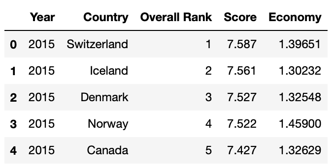
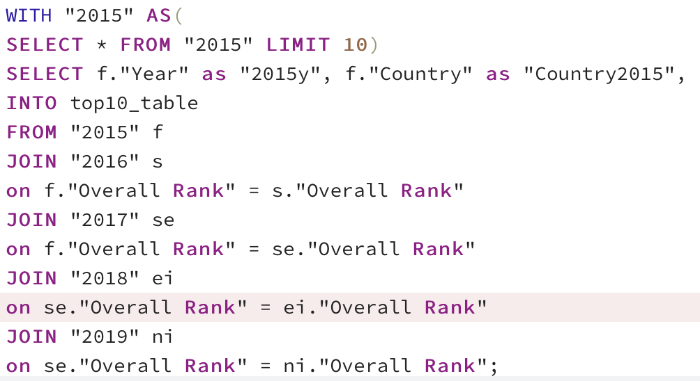
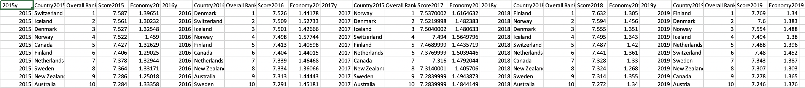

# world-happiness-analysis
Jiayi's branch

## Segment 2, Database Integration
- Updated schema.sql to make sure all the column names match happiness_machine_learning_model.ipynb
- Insert Year column to all tables
- Changed all column headers to common names
- Dropped unnecessary columns
- Rearranged column order
Example: New 2015 Table
  
- Made sure all tables are added to SQL
- Join 2015-2019 tables for easy comparison 
- Limited only top 10 countries
  

 
  Please see Top 10 Join Table:
  