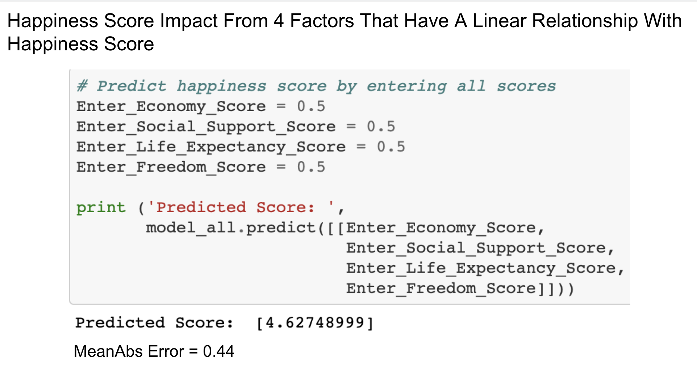
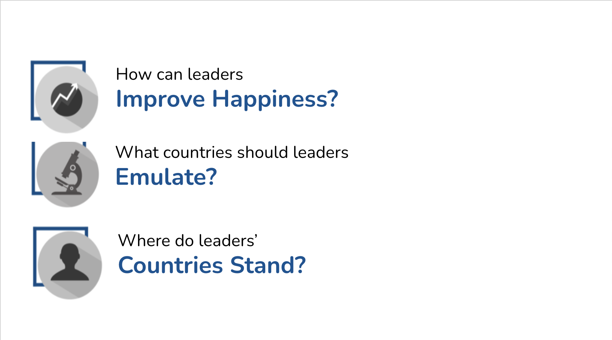

# World Happiness Report Analysis

## Dutties of Elisa Sanchez in Segment 4

1. Speaker notes for these sections of the presentation: (1) linear regression, (2) multi-linear regression, and (3) recommendations for future analysis. Speaker notes can be found on the speaker notes section of the google slides presentation: https://docs.google.com/presentation/d/1je9CL1JwoPcUeFXnZpdcBnvSOB8u3dD5zN5oEoaod8A/edit?ts=5fd2eac1#slide=id.gaaf09a9437_0_157. Here are the slides with the speaker notes: 

.png)

.png)

.png)

2. Updated design and added transition slides to improve presentation fluidity. Transition slides are slide 3, slide 4, slide 9, slide 11 and slide 15. Here's a screen shot of the template used for these slides: 

